# Informações do Projeto
`CÁLCULO DE PEÇAS FALTANTES`  

O projeto visa criar um software, utilizando apenas tecnologias de front-end, com o objetivo de entregar um aumento na facilidade de gestão de gastos e controle de estoque.

Dessa forma o setor industríal pode reduzir os custos e ganhar performance na construção de seus produtos, evitando perdas por alto estoque ou falta de peças necessárias para completar um determinado serviço.

 

`ENGENHARIA DE SOFTWARE` 

Assim como descrito na página inicial do curso, a engenharia de Software da Pontífica Universidade Católica de Minas Gerais (PUC Minas) possui o objetivo de formar profissionais com base sólida em Ciência da Computação, Matemática e Produção.

A disciplina de Trabalho Interdisciplinar: Aplicações WEB, ministrada pelos professores Amália Soares Vieira de Vasconcelos, Joao Luiz Silva Barbosa, Rommel Vieira Carneiro e Simone Alves Nogueira, visa em seu projeto final, a construção do conhecimento técnico aplicável de seus alunos, de forma que ocorra a entrega de um projeto completo capaz de resolver problemas reais.

## Participantes

O projeto foi pensado, criado e desenvolvido por estudantes de engenharia de software do primeiro período noturno da PUC Minas.

Sendo eles:

- Daniel Estevam Pacheco de Souza
- Gabriel Augusto Souza Borges
- Lucas Machado de Oliveira Andrade
- Pedro Rabelo de Freitas
- Rafael Pierre Martins

# Estrutura do Documento

- [Informações do Projeto](#informações-do-projeto)
  - [Participantes](#participantes)
- [Estrutura do Documento](#estrutura-do-documento)
- [Introdução](#introdução)
  - [Problema](#problema)
  - [Objetivos](#objetivos)
  - [Justificativa](#justificativa)
  - [Público-Alvo](#público-alvo)
- [Especificações do Projeto](#especificações-do-projeto)
  - [Personas e Mapas de Empatia](#personas-e-mapas-de-empatia)
  - [Histórias de Usuários](#histórias-de-usuários)
  - [Requisitos](#requisitos)
    - [Requisitos Funcionais](#requisitos-funcionais)
    - [Requisitos não Funcionais](#requisitos-não-funcionais)
  - [Restrições](#restrições)
- [Projeto de Interface](#projeto-de-interface)
  - [User Flow](#user-flow)
  - [Wireframes](#wireframes)
- [Metodologia](#metodologia)
  - [Divisão de Papéis](#divisão-de-papéis)
  - [Ferramentas](#ferramentas)
  - [Controle de Versão](#controle-de-versão)
<!-- - [**############## SPRINT 1 ACABA AQUI #############**](#-sprint-1-acaba-aqui-)
- [Projeto da Solução](#projeto-da-solução)
  - [Tecnologias Utilizadas](#tecnologias-utilizadas)
  - [Arquitetura da solução](#arquitetura-da-solução)
- [Avaliação da Aplicação](#avaliação-da-aplicação)
  - [Plano de Testes](#plano-de-testes)
  - [Ferramentas de Testes (Opcional)](#ferramentas-de-testes-opcional)
  - [Registros de Testes](#registros-de-testes)
- [Referências](#referências) -->

# Introdução

Kiichiro Toyoda foi um empresário que deu início ao processo de Just In Time. Esse processo revolucionou a indústria como conhecemos e permitiu que qualquer empresa, independente de seu tamanho, minimize seu estoque ao máximo. Isso é positivo, pois estoques possuem custos elevados em sua manutenção, logo a sua redução permite uma diminuição dos gastos, aumento dos lucros e possibilidade de verder o produto de forma mais acessível ao consumidor, criando um melhor poder de compra para a população que usufrui dos produtos criados pela indústria.

Foi observado, também, em alguns momentos na história, táticas que visam o aumento do estoque, crendo que basta produzir mais, pois o mercado consumidor é capaz de acompanhar o aumento de produção. Entretanto, essas táticas podem ocasionar crises econômicas na empresa ou no mundo, assim como foi presenciado nos Estados Unidos, em 1929, pelo American Way Of Life.

Entretanto, nem todas as empresas possuem políticas e infraestruturas que permitem a utilização completa do sistema Just In Time. Para essas empresas, o objetivo é se aproximar ao máximo do sistema criado por Toyota, para isso, é necessário minimizar ao máximo o estoque e controlar seu sistema de trânsito, compras e construção, gerando assim a máxima redução possível nos gastos com estoque, desperdício e atrasos por falta de materiais necessários.

Somado a isso, há um aumento na necessidade de respostas rápidas e investimentos em sistemas mais modernos, que ofereçam aos consumidores o produto que eles desejam. Nesse momento da história, o mercado alterou seu pensamento, a ideia de que criar a necessidade para seu produto foi substituída pela de entregar ao consumidor o que ele de fato precisa ou almeja.

Logo, surge um aumento constante na importância da gestão competende de estoque, não basta ter todas as peças necessárias em excesso em centrais de distribuições gigantescas, é necessário possuir somento aquilo que será utilizado naquele momento, sem que deixe faltar qualquer peça ou prejudicar qualquer construção.

## Problema

Portanto, o grande problema que essas empresas enfrentam é descobrir quanto e quando comprar, de forma que se obtenha os menores gastos e estoque possíveis, sem afetar a construção e sem deixar faltar qualquer peça no meio da produção.

## Objetivos

O cálculo de peças faltantes vem com o objetivo de se tornar uma ferramente de software que auxilie nesse sistema de gestão. Trazendo as informações necessárias para que diversos setores da indústria possam trabalhar de forma integrada sem a necessidade da comunição informal para efetuar seu trabalho de forma competente.

Entre esses setores, podem ser mencionados o administrativo, o setor de compras, estoque e os gestores.

Entre as informações necessárias para o software, estão as telas de cadastros e de informações finais.

* Cadastros:
	* Fornecer uma forma de cadastrar os produtos vendidos e as peças necessárias para criação desses produtos;
	* Fornecer um sitema responsivo, para uso em Tablet e computadores que permita alterações simples e rápidas nas quantidades de produtos em estoque;
	* Permitir que o usuário efetue a importação de dados de compras dos consumidores finais, assim como a quantidade comprada e a data prevista para a entrega.

* Informações Finais:
	* Fornecer uma tabela com todos os materiais faltantes para o dia de hoje, assim como para os próximos dias;
	* Informar ao usuário a quantidade de materiais faltantes para cada dia;
	* Informar o que é possível construir na data de hoje.

## Justificativa

Em um estudo de caso feito por William da Silva Barbosa, focado na área de administração mostrou como a gestão de estoque pode influenciar nos ganhos de uma empresa.

Nesse aspecto, a empresa que não autorizou a divulgação do nome observou um total de R$150.000.000,00 estocados, sendo que 10% desse valor eram em produtos obsoletos.

Além disso, parâmetros incorretos nos cálculos de compras (MRP) informavam aos compradores a necessidade de comprar quantidades excessivas ou inferiores ao que de fato era desejado.

Logo, há uma observação de que a gestão competente de estoque pode ser um fator fundamental para o crescimento de uma empresa, para isso, softwares que auxiliem e tragam uma visualição de fácil utilização e acesso se tornam necessários para facilitar esse crescimento. 

## Público-Alvo

Para esse projeto, foi estabelecido como público alvo, pequenas e médias empresas que visam um crescimento econômico e uma redução nos gastos.

Esse público alvo foi definido, pois, a são essa empresas que possuem como maior ponto fraco a gestão de estoque e de compras de materiais. Afinal sua gestão, muitas vezes é feita por meio de ferramentas de edição de planilhas, sem automação e com alta possibilidade de erros humanos.

# Especificações do Projeto

......  COLOQUE AQUI O SEU TEXTO ......

> Apresente uma visão geral do que será abordado nesta parte do
> documento, enumerando as técnicas e/ou ferramentas utilizadas para
> realizar a especificações do projeto

## Personas e Mapas de Empatia

......  COLOQUE AQUI O SEU TEXTO ......

> Relacione as personas identificadas no seu projeto e os respectivos mapas de empatia. Lembre-se que 
> você deve ser enumerar e descrever precisamente e de forma
> personalizada todos os principais envolvidos com a solução almeja. 
> 
> Para tanto, baseie-se tanto nos documentos disponibilizados na disciplina
> e/ou nos seguintes links:
>
> **Links Úteis**:
> - [Persona x Público-alvo](https://flammo.com.br/blog/persona-e-publico-alvo-qual-a-diferenca/)
> - [O que é persona?](https://resultadosdigitais.com.br/blog/persona-o-que-e/)
> - [Rock Content](https://rockcontent.com/blog/personas/)
> - [Hotmart](https://blog.hotmart.com/pt-br/como-criar-persona-negocio/)
> - [Mapa de Empatia](https://resultadosdigitais.com.br/blog/mapa-da-empatia/)
> - [Como fazer um mapa de empatia - Vídeo](https://www.youtube.com/watch?v=JlKHGpVoA2Y)
> 
> 
> **Exemplo de Persona**
> 
> 
> 
> Fonte: [Como criar uma persona para o seu negócio](https://raissaviegas.com.br/como-criar-uma-persona/)

## Histórias de Usuários

Com base na análise das personas forma identificadas as seguintes histórias de usuários:

|EU COMO... `PERSONA`| QUERO/PRECISO ... `FUNCIONALIDADE` |PARA ... `MOTIVO/VALOR`                 |
|--------------------|------------------------------------|----------------------------------------|
|Usuário do sistema  | Registrar minhas tarefas           | Não esquecer de fazê-las               |
|Administrador       | Alterar permissões                 | Permitir que possam administrar contas |

> Apresente aqui as histórias de usuário que são relevantes para o
> projeto de sua solução. As Histórias de Usuário consistem em uma
> ferramenta poderosa para a compreensão e elicitação dos requisitos
> funcionais e não funcionais da sua aplicação. Se possível, agrupe as
> histórias de usuário por contexto, para facilitar consultas
> recorrentes à essa parte do documento.
>
> **Links Úteis**:
> - [Histórias de usuários com exemplos e template](https://www.atlassian.com/br/agile/project-management/user-stories)
> - [Como escrever boas histórias de usuário (User Stories)](https://medium.com/vertice/como-escrever-boas-users-stories-hist%C3%B3rias-de-usu%C3%A1rios-b29c75043fac)

## Requisitos

As tabelas que se seguem apresentam os requisitos funcionais e não funcionais que detalham o escopo do projeto.

### Requisitos Funcionais

Os requisitos funcionais são features, funções e aspectos do software que o cliente irá exigir para o time de desenvolvimento.
No nosso caso, para o projeto de peças faltantes, teríamos os seguintes requisitos funcionais:

|ID    | Descrição do Requisito  | Prioridade |
|------|-----------------------------------------|----|
|RF-001| Permitir que o usuário cadastre tarefas | ALTA | 
|RF-002| Emitir um relatório de tarefas para um determinado período de tempo   | ALTA |
|RF-003| Permitr que o usuário cadastre estoque | ALTA |
|RF-006| Permitir cadastro de materiais comprados | ALTA |
|RF-004| Persistência de dados | MÉDIA |
|RF-005| Permitir diferentes visualizações para diferentes usuários | BAIXO |

### Requisitos não Funcionais

Os requisitos não funcionais são funções que serão necessárias para implementar os requisitos funcionais, mas que não serão
explicitamente pedidas pelo cliente.
No nosso caso, para o projeto de peças faltantes, teríamos os seguintes requisitos não funcionais:

|ID     | Descrição do Requisito  |Prioridade |
|-------|-------------------------|----|
|RNF-001| O sistema deve ser responsivo para rodar em diferentes dispositivos | MÉDIA | 
|RNF-002| Deve processar requisições do usuário em no máximo 3s |  BAIXA | 
|RNF-003| Persistir os dados utilizando local storage |  BAIXA | 

## Restrições

O projeto está restrito pelos itens apresentados na tabela a seguir.

|ID| Restrição                                             |
|--|-------------------------------------------------------|
|01| O projeto deverá ser entregue até o final do semestre |
|02| Não pode ser desenvolvido um módulo de backend        |

# Projeto de Interface

### Projeto consiste em 4 telas, Uma para cadastro de produto completo. Vamos usar o exemplo de uma bicileta. Uma outra tela para cadastro de partes de peças, como rodas, assentos etc. Outra tela para mostrar o estoque das peças de diferentes produtos e por fim uma para mostrar peças faltantes no estoque

## User Flow

> Fluxo de usuário (User Flow) é uma técnica que permite ao desenvolvedor
> mapear todo fluxo de telas do site ou app. Essa técnica funciona
> para alinhar os caminhos e as possíveis ações que o usuário pode
> fazer junto com os membros de sua equipe.
>
### Siga o link do Figma para vizualizar melhor o fluxo de usuário ->:
<a href="https://www.figma.com/file/QtHZvvj5LAdZmVEdyoT4Fe/Stable-Tables-(Community)?node-id=0%3A1">Link do figma</a>
> 
>
> **Fluxo de usuário**:
> 

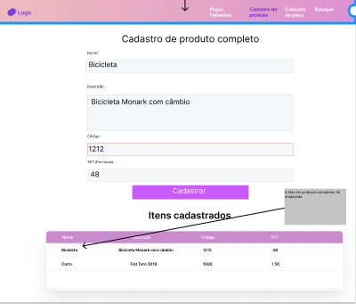

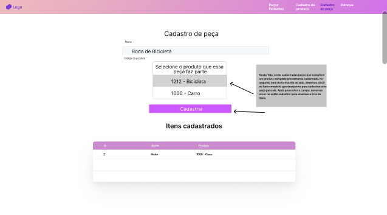

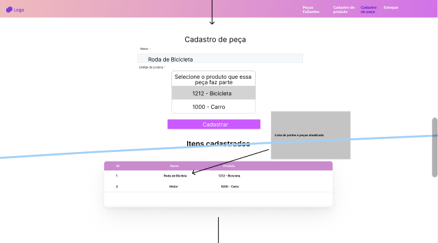

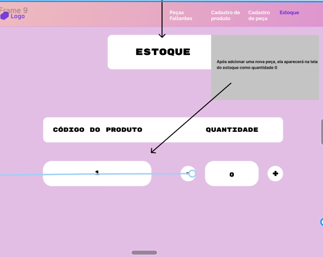

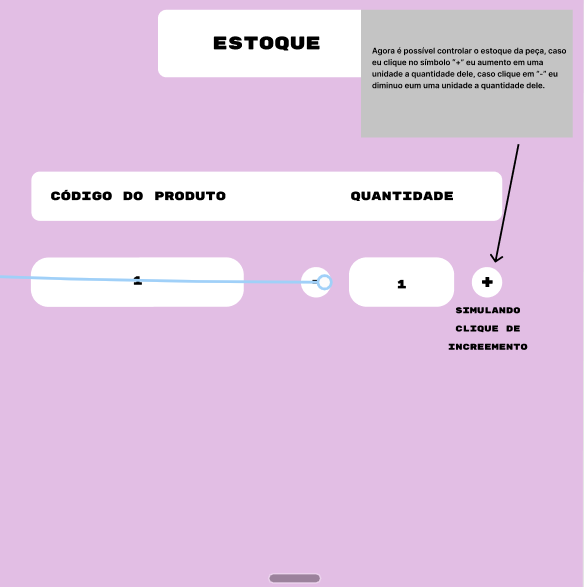

## Wireframes

> Wireframes são protótipos das telas da aplicação usados em design de interface para sugerir a
> estrutura de um site web e seu relacionamentos entre suas
> páginas. Um wireframe web é uma ilustração semelhante ao
> layout de elementos fundamentais na interface.
> 
> 
> **Wireframes:**:
> 

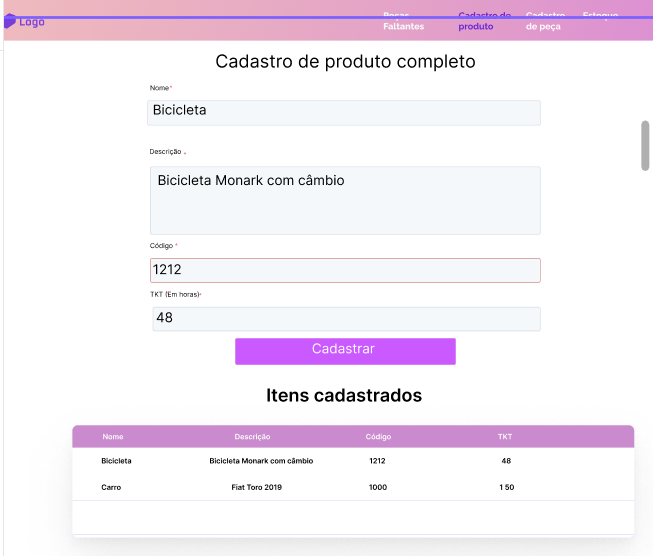

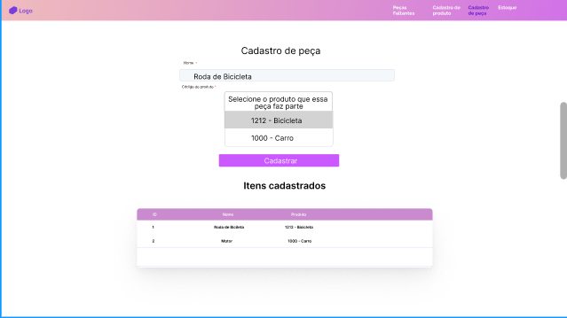

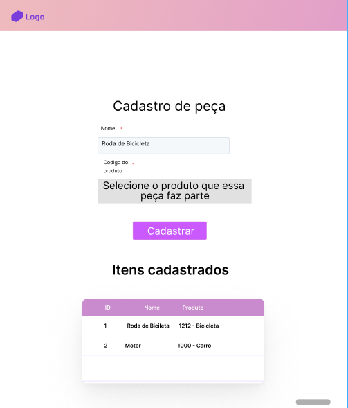

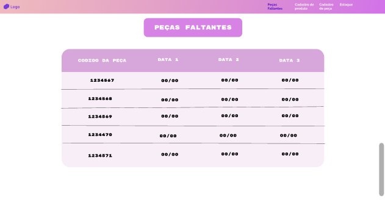

# Metodologia

Esse projeto utiliza de frameworks embasados no manifesto ágil, com o objetivo de gerir de forma eficaz o projeto e criar uma infraestrutura que permita que todos os envolvidos contemplem todo o sistema utilizado.

Com esse pensamento é possível criar um projeto transparente e com grande possibilidade de avanços em um curto período de tempo.

Inicialmente, visando a ideia de Design Thinking, foi utilizado o sistema de gestão do Miro, respeitando os layouts disponibilizados.

Utilizando essa ferramento foi possível criar o escopo inicial do projeto a partir da criação do Mapa de Priorização de Ideias.

Para Gerir a aplicação, a principal ferramenta utilizada foi o GitHub. Com ele é possível verssionar os códigos na aba Code, assim como criar um sistema de quadro de sinalização de fluxo de produção na aba Projects.

Utilizando o sistema de Pull Requests e Issues o Project criado pode ser dinâmico, de forma que o progresso das tarefas são atualizados em conjunto com o desenvolvimento. Além disso, o sistema de Pull Request permite que um desenvolvedor verifique o código do outro e solicite melhorias ou modificações, trazendo mais confiabilidade ao código e um aumento do conhecimento dos envolvidos na aplicação como todo.

Esse sistema será utilizado como uma ferramenta para implementação do Scrum, uma estrutura baseada no manifesto ágil, que visa dividir e priorizar as tarefas, além de estruturar um acompanhamento transparente para que todos possam observar as melhorias e avanços do projeto em tempo de execução.

As sprints do projeto são divididas em 4 grandes sprints com o duração de 4 semanas. Entretanto, haverá uma review interna e divisão das tarefas contemplando sprints de uma semana, isso é necessário para manter um acompanhamento constante e de qualidade do projeto.

Para o acompanhamento das evoluções, além do Project, serão feitas reuniões diárias em que os desenvolvedores podem exibir para todos seu trabalho e suas dificuldades, com o objetivo de que os problemas sejam solucionados rapidamente e de forma eficaz.

## Divisão de Papéis

Com o objetivo de identificar os papéis de cada membro do grupo foi criado um formulário questionando o desejo de cada membro em ocupar um determinado cargo, assim como quem ele acredita ser o melhor integrante para cada papel.

Além disso, todos os integrantes terão responsabilidades de desenvolvimento, logo todos irão participar do Development Team.

Logo, baseado na pesquisa e na premissa anterior, cada membro possui as responsabilidades de acordo com a descrição abaixo:

* **Scrum Master**
	* Lucas Machado de Oliveira Andrade

* **Product Owner:**
	* Rafael Pierre

* **Design UX**
	* Gabriel Augusto Souza Borges

* **Development Team:**
	* Daniel Estevam Pacheco de Souza
	* Gabriel Augusto Souza Borges
	* Lucas Machado de Oliveira Andrade
	* Pedro Rabelo de Freitas
	* Rafael Pierre 

Com o objetivo de organizar as divisões das tarefas no projeto, o Project do GitHub foi escolhido como ferramenta principal, estruturado nos seguintes campos:

* **Backlog**: Implementações que necessitam de implementação, mas não possuem nenhum desenvolvedor atrelado a ela e não necessariamente será efetuada durante a sprint;

* **To do**: Tarefa que já foi definida por quem deve ser implementada e deve ser entregue na sprint;

* **In progress**: Tarefa que está sendo efetuada pelo responsável, mas ainda não está finalizada;

* **Homologação**: Tarefa que está pronta, mas ainda está passando por testes e verificações, antes de receber o Pull Request para a master, logo, ela só existe no ambiente de homologação;

* **Done**: Tarefa completa, que recebeu um Pull Request para a master, ou que não precisa de nenhuma outra ação afetuada.

O quadro abaixo apresenta o sistema definido para gestão do grupo.

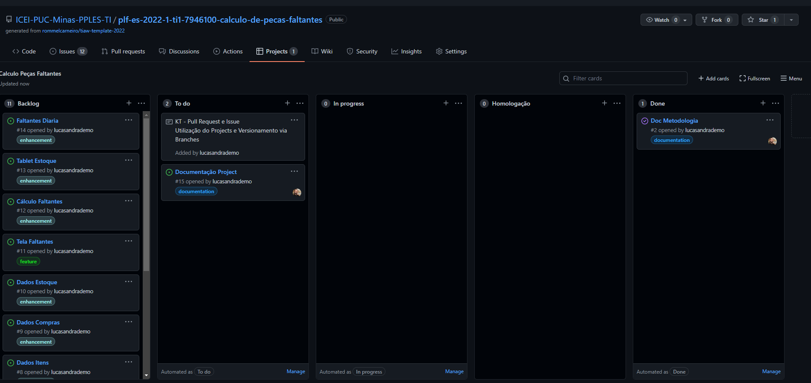

## Ferramentas

| Ambiente  | Plataforma              |Link de Acesso |
|-----------|-------------------------|---------------|
| Processo de Design Thinkgin  | Miro |  https://miro.com/app/board/uXjVOA2ChQA=/ | 
| Repositório de código | GitHub | https://github.com/ICEI-PUC-Minas-PPLES-TI/plf-es-2022-1-ti1-7946100-calculo-de-pecas-faltantes | 
| Gerenciamento do Projeto | GitHub Projects | https://github.com/ICEI-PUC-Minas-PPLES-TI/plf-es-2022-1-ti1-7946100-calculo-de-pecas-faltantes/projects/1 | 
| Hospedagem do site | GitHub Pages | http://pecas-faltantes.com/ | 
| Protótipo Interativo | Figma | https://www.figma.com/file/QtHZvvj5LAdZmVEdyoT4Fe/Stable-Tables-(Community)?node-id=0%3A1 | 
| Ferramentas de comunicação | Discord | Servidor Privado para as Dailys e Sprint Review |

## Controle de Versão

O sistema de versionamento de código é efetuado por meio de Pull Requests e Issues.

* Branch:
	* `master`: versão final do projeto;
	* `homologacao`: versão de testes, pode ocorrer inconsistências com a master;
	* `iss`: branches para o desenvolvedor modificar e criar códigos.

* Pull Request:
	* Ocorre uma vez por semana;
	* Merge das branches iss para a master;
	* Responsabilidade do Scrum Master.
	* utilizam o sistema de labels das issues

* Issue:
	* Criação de uma nova branch para cada issue;
	* Merge em homologação após finalização da issue;
	* Nome "username" + "/" + "issue" + "número do issue";
	* utilizaram o sistema de labels descrito na imagem abaixo:

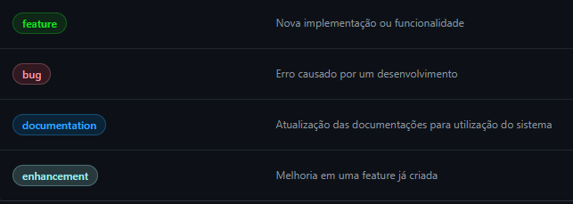

Logo, o workflow relacionado ao sistema de branches pode ser observado na imagem a seguir:

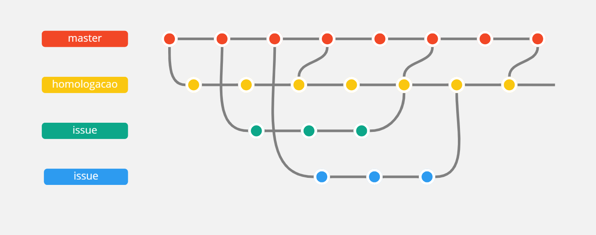

<!-- # **############## SPRINT 1 ACABA AQUI #############** -->

<!-- # Projeto da Solução

......  COLOQUE AQUI O SEU TEXTO ......

## Tecnologias Utilizadas

......  COLOQUE AQUI O SEU TEXTO ......

> Descreva aqui qual(is) tecnologias você vai usar para resolver o seu
> problema, ou seja, implementar a sua solução. Liste todas as
> tecnologias envolvidas, linguagens a serem utilizadas, serviços web,
> frameworks, bibliotecas, IDEs de desenvolvimento, e ferramentas.
> Apresente também uma figura explicando como as tecnologias estão
> relacionadas ou como uma interação do usuário com o sistema vai ser
> conduzida, por onde ela passa até retornar uma resposta ao usuário.
> 
> Inclua os diagramas de User Flow, esboços criados pelo grupo
> (stoyboards), além dos protótipos de telas (wireframes). Descreva cada
> item textualmente comentando e complementando o que está apresentado
> nas imagens.

## Arquitetura da solução

......  COLOQUE AQUI O SEU TEXTO E O DIAGRAMA DE ARQUITETURA .......

> Inclua um diagrama da solução e descreva os módulos e as tecnologias
> que fazem parte da solução. Discorra sobre o diagrama.
> 
> **Exemplo do diagrama de Arquitetura**:
> 
>  -->

<!-- # Avaliação da Aplicação

......  COLOQUE AQUI O SEU TEXTO ......

> Apresente os cenários de testes utilizados na realização dos testes da
> sua aplicação. Escolha cenários de testes que demonstrem os requisitos
> sendo satisfeitos.

## Plano de Testes

......  COLOQUE AQUI O SEU TEXTO ......

> Enumere quais cenários de testes foram selecionados para teste. Neste
> tópico o grupo deve detalhar quais funcionalidades avaliadas, o grupo
> de usuários que foi escolhido para participar do teste e as
> ferramentas utilizadas.
> 
> **Links Úteis**:
> - [IBM - Criação e Geração de Planos de Teste](https://www.ibm.com/developerworks/br/local/rational/criacao_geracao_planos_testes_software/index.html)
> - [Práticas e Técnicas de Testes Ágeis](http://assiste.serpro.gov.br/serproagil/Apresenta/slides.pdf)
> -  [Teste de Software: Conceitos e tipos de testes](https://blog.onedaytesting.com.br/teste-de-software/)

## Ferramentas de Testes (Opcional)

......  COLOQUE AQUI O SEU TEXTO ......

> Comente sobre as ferramentas de testes utilizadas.
> 
> **Links Úteis**:
> - [Ferramentas de Test para Java Script](https://geekflare.com/javascript-unit-testing/)
> - [UX Tools](https://uxdesign.cc/ux-user-research-and-user-testing-tools-2d339d379dc7)

## Registros de Testes

......  COLOQUE AQUI O SEU TEXTO ......

> Discorra sobre os resultados do teste. Ressaltando pontos fortes e
> fracos identificados na solução. Comente como o grupo pretende atacar
> esses pontos nas próximas iterações. Apresente as falhas detectadas e
> as melhorias geradas a partir dos resultados obtidos nos testes. -->

# Referências

Abaixo seguem links utilizados para fundamentar a construção desse trabalho.

- [Formato ABNT](https://www.normastecnicas.com/abnt/trabalhos-academicos/referencias/)
- [Referências Bibliográficas da ABNT](https://comunidade.rockcontent.com/referencia-bibliografica-abnt/)
- [Engenharia de Software PUC Minas](https://www.pucminas.br/unidade/praca-da-liberdade/ensino/graduacao/Paginas/Engenharia-de-Software.aspx)
- [Barbosa, William da S. REDUÇÃO DE CUSTOS E SEU IMPACTO NA GESTÃO DE ESTOQUE, ano 2014](https://cepein.femanet.com.br/BDigital/arqTccs/1111390153.pdf)
- [Manifesto Ágil](https://agilemanifesto.org/)
